# Exercise 1: Setup New Project in Azure DevOps

## Task 1: Create New Project

1. Sign in to Azure DevOps
2. Select **Create project**

    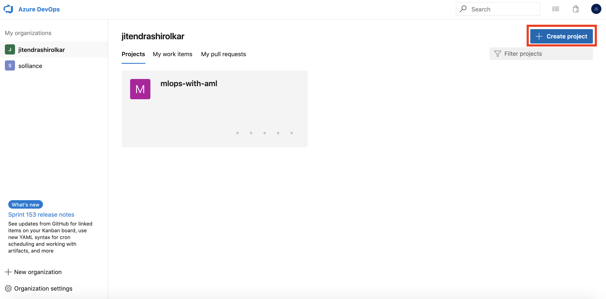

3. Provide Project Name: `mlops-quickstart` and select **Create**

    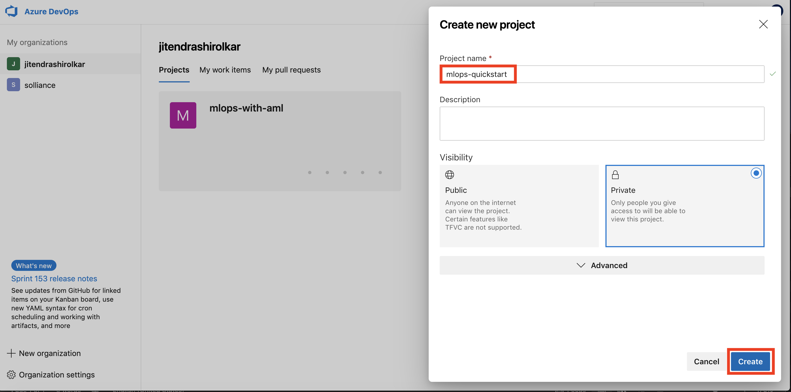

## Task 2: Import Quickstart code from a Github Repo

1. Within the new project:

   a. Select **Repos** from left navigation bar
   
   b. Select **Import** from the content section
   
      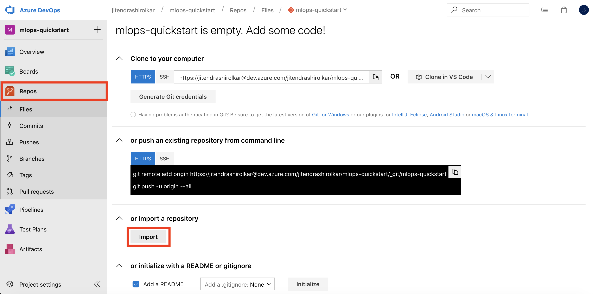
   
2. Provide the following Github URL: `https://github.com/solliancenet/mlops-starter.git` and select **Import**. This should import the code required for the quickstart.

    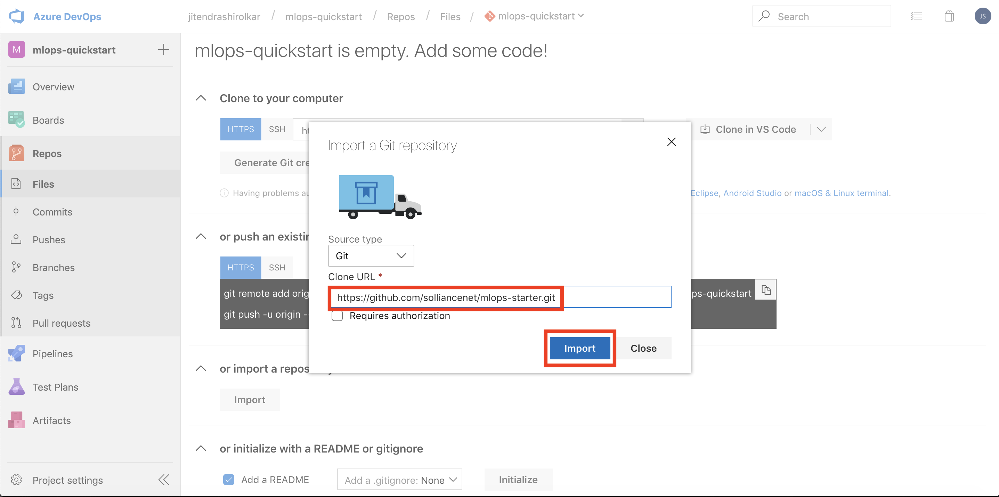

## Task 3: Update the build YAML file

1. Select and open the `azure-pipelines.yml` file
2. Select **Edit** and update the following variables: `resourcegroup`, `workspace` and `location`. If you are using your own Azure subscription, please provide names to use. If an environment is provided to you be sure to replace XXXXX in the values below with your unique identifier and update the `location` variable.

    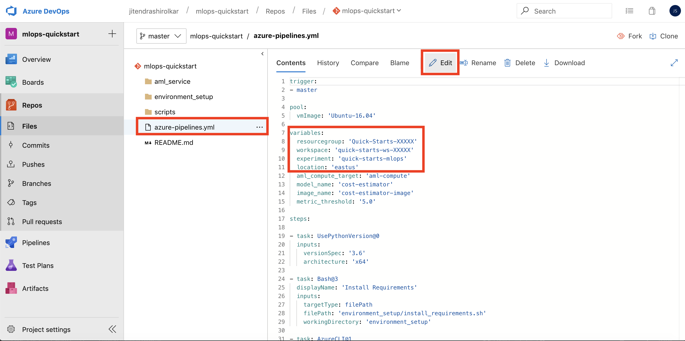

3. Select **Commit** to save your changes.

    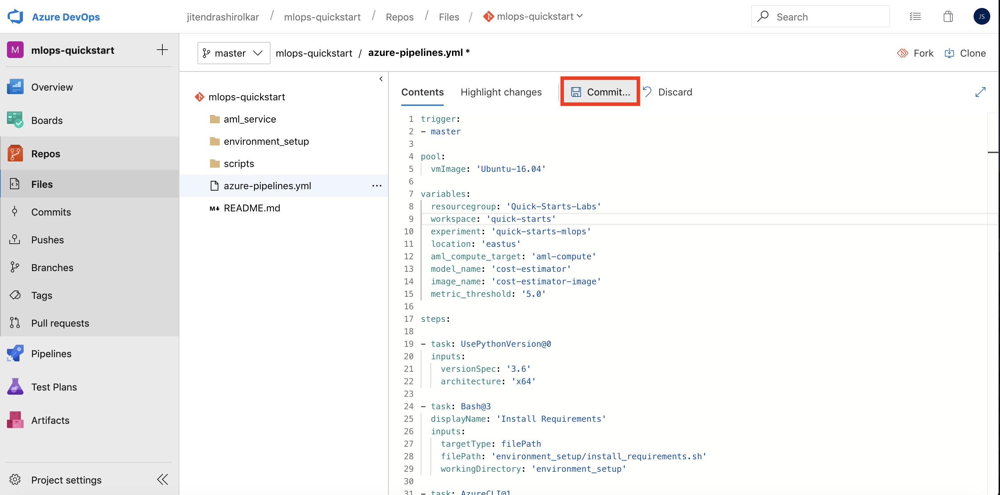
  
## Task 4: Create new Service Connection

1. From the left navigation select **Project settings** and then select **Service connections**

    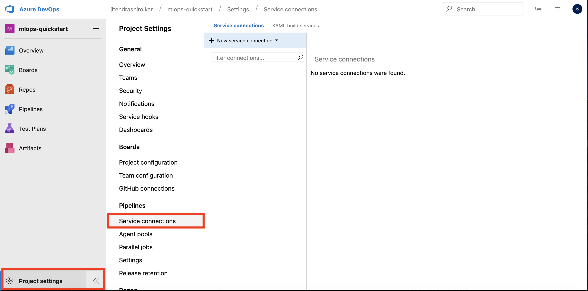

2. Select **New service connection** and then select **Azure Resource Manager**

    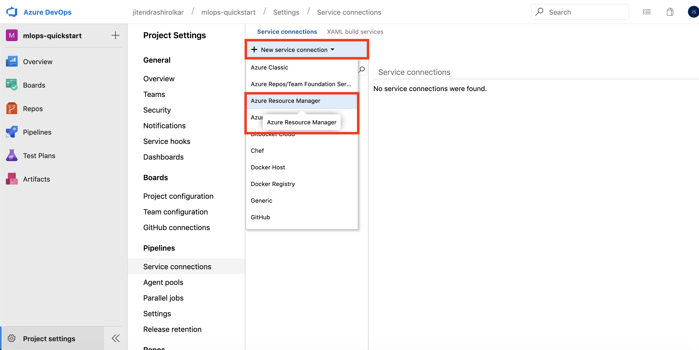

3. Provide the following information in the `Add an Azure Resource Manager service connection` dialog box and then select **Ok**:
 
   a. Connection name: `quick-starts-sc`
   
   b. Subscription: Select the Azure subscription to use
   
   c. Resource Group: This value should match the value you provided in the `azure-pipelines.yml` file
   
    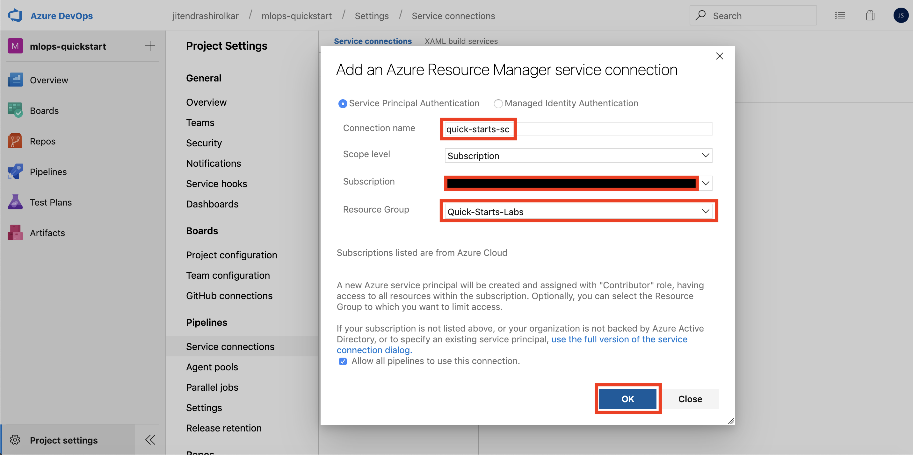

# Exercise 2: Setup and Run the Build Pipeline

## Task 1: Setup Build Pipeline

1. From left navigation select **Pipelines, Builds** and then select **New pipeline**

    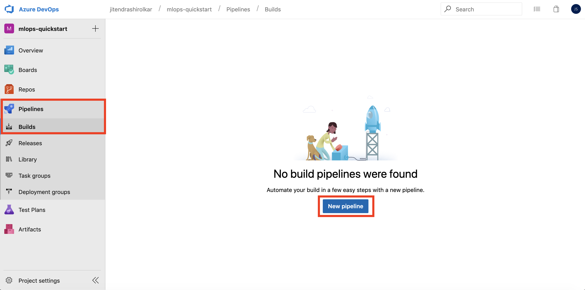
    
2. Select **Azure Repos Git** as your code repository

    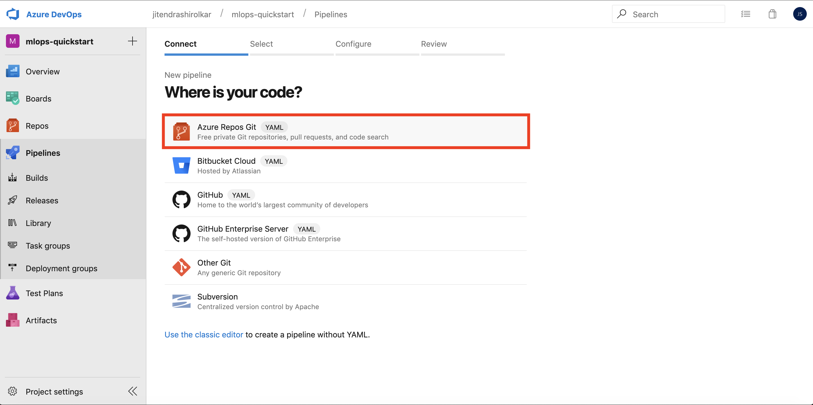

3. Select **mlops-quickstart** as your repository

    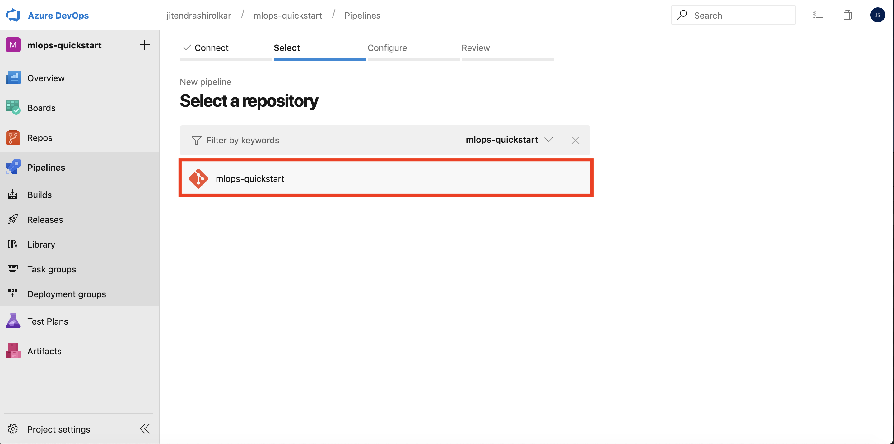

4. Reivew the YAML file

    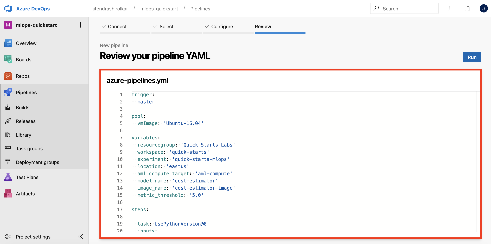

## Task 2: Run the Build Pipeline

1. Select **Run** to start running your build pipeline

    

2. Monitor the build run. The build pipeline will take around *10-12 minutes* to run.

    

## Task 3: Review Build Artifacts

1. The build will publish an artifact named `devops-for-ai`. Select **Artifacts, devops-for-ai** to review the artifact contents.

    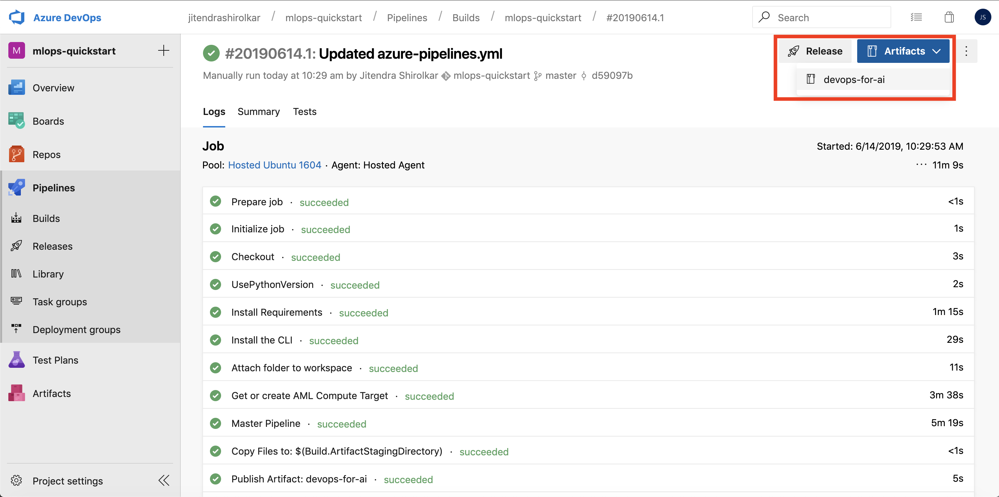

2. Select **outputs, eval_info.json** and then select **Download**. The `eval_info.json` is the output from the *model evaluation* step and the information from the evaluation step will be later used in the release pipeline to deploy the model. Select **Close** to close the dialog.

    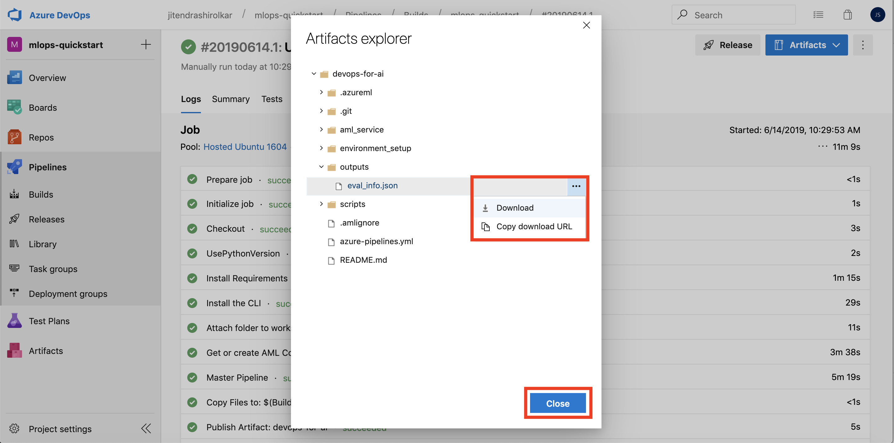

3. Open the `eval_info.json` in a json viewer or a text editor and observe the information. The json output contains information such as if the model passed the evaluation step (`deploy_model`: *true or false*), and the name of the created image (`image_name`) to deploy.

    

