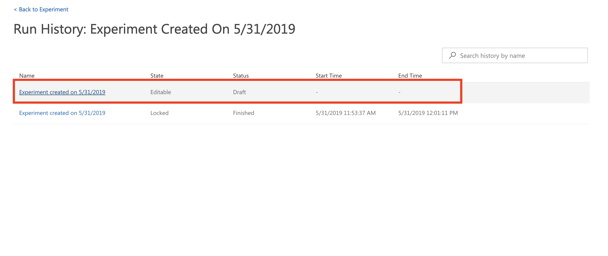

## Before you begin

- Download the training data file [nyc-taxi-sample-data.csv](https://quickstartsws9073123377.blob.core.windows.net/azureml-blobstore-0d1c4218-a5f9-418b-bf55-902b65277b85/quickstarts/nyc-taxi-data/nyc-taxi-sample-data.csv) on your local disk.
- Confirm that you have setup the prerequisites from: [quickstart-2.0](../quickstart-2.0)

## Step 1: Navigate to Visual Interface in Azure Portal

1. Navigate to the machine learning workspace: `quick-starts-ws`
2. Select `Visual interface` in the left navigation bar
3. Click on **Launch visual interface**

## Step 2: Upload Training Dataset

1. Click on **+ New**
2. Select **Datasets**
3. Click on **Upload from Local File**
4. Navigate to `nyc-taxi-sample-data.csv` on your local disk and click **Ok**

## Step 3: Create New Blank Experiment and Select your Dataset

1. Click on **+ New**
2. Select **+ Blank Experiment**
3. Expand **Saved Datasets, My Datasets** in the left navigation
4. Drag and drop your dataset `nyc-taxi-sample-data.csv` on to the canvas

## Step 4: Transform your data

1. Open **Data Transformation, Manipulation section** section in the left panel
2. Drag and drop **Select Columns in Dataset** module on to the canvas
3. Select the added `Select Columns in Dataset` module
4. Click on **Edit columns** in the right panel
5. Select **Begin With All Columns** and then in the drop down select **Exclude**. Enter the column name `vendorID` in the textbox.
6. Add **Clean Missing Data** module
7. Sequentially connect the three modules
8. Select the added  `Clean Missing Data` module
9. Select `Replace with mean` as `Cleaning mode` in the right panel
10. Click on **Edit columns** in the right panel
11. Exclude the two non-numeric data columns `normalizeHolidayName` and `isPaidTimeOff`
12. Expand **Data Transformation, Sample and Split** in the left navigation and add the **Split Data** module 
13. Connect the first output from `Clean Missing Data` module to the `Split Data` module
14. Select the **Split Data** module and set `0.7` as the fraction of rows in first output

*Note that you can run the experiment at any point to peek at the outputs and activities. Running experiments also generates metadata that is available for downstream activities such selecting column names from a list in selection dialogs.*

## Step 5: Initialize your Regression Model

1. Expand **Machine Learning, Initialize Model, Regression** section in the left panel
2. Add the **Boosted Decision Tree Regression** module on to the canvas
3. Configure your model parameters: `Minimum number of samples per node: 1` and `Learning rate: 0.1`

## Step 6: Setup Train Model Module

1. Expand **Machine Learning, Train** section in the left panel
2. Add **Train Model** module on to the canvas
3. Click on **Edit columns** in the right panel to setup your `Label or Target column`
4. Select `totalAmount` as your target column

## Step 7: Setup Score Model and Evaluate Model Modules

1. Expand **Machine Learning, Score** section in the left panel
2. Add **Score Model** module on to the canvas
3. Complete the model training and scoring connections
   - Connect the `Boosted Decision Tree Regression` module to `Train Model` module
   - Connect the `Train Model` module to the first input of the `Score Model` module
   - Connect the first output of `Split Data` module to `Train Model` module
   - Connect the second output of `Split Data` module to the second input of the `Score Model` module
4. Note that `Split Data` module will feed data for both model training and model scoring. The first output (0.7 fraction) will connect with the `Train Model` module and the second output (0.3 fraction) will connect with the `Score Model` module.
5. Open **Machine Learning, Evaluate** section in the left panel
6. Add **Evaluate Model** module on to the canvas
7. Connect the `Score Model` module to `Evaluate Model` module

## Step 8: Run the Experiment

1. Click on **Run**
2. Note that you can create a new **Compute Target** directly from **Visual Interface**
3. Select the existing compute target we created upfront in `quickstart-2.0`
4. Click on **Run**
5. The experiment will run for about 8-10 minutes 

## Step 9: Visualize the Model Predictions

1. Wait for model training to be complete
2. Right click on **Score Model** module and select **Scored dataset -> Visualize**
3. Compare the predicted `predicted taxi fares` to the `target taxi fares`
4. You can also observe the predicted value distribution when you select the `Scored Labels` column 
 

## Step 10: Visualize the Evaluation Results

1. Right click on **Evaluate Model** module and select **Evaluation results -> Visualize**
2. Observe the Model Evaluation Metrics such as **Root Mean Squared Error**

## Step 11: Experiment Run History

1. Click on **Run History**
2. Go back to the Experiment by clicking on the `Editable` version of the Run History

## Step 12: Save the Trained Model

1. Right click on the `Train Model` module and select **Trained model -> Save as Trained Model**
2. Save the Trained Model

## Step 13: Run Predictive Experiment

1. Observe the saved model appears in the `Trained Models` section
2. Click on **Create Predictive Experiment**
3. Click on **Run**
4. Select the existing compute target to run the experiment
5. It will take about 4-5 minutes to run the predictive experiment

## Step 14: Deploy Web Service

1. Click on **Deploy Web Service**
2. Select the existing Kubernetes Service compute, and click **Deploy**

## Step 15: Test the Deployed Web Service

1. Navigate to the Web Services section of the Visual Interface, and open the web service
2. Fill in the data to predict with your web service, and click **Test**
3. Observed the **Raw** test results and predicted output **Scored Labels**

## Step 16: Review how to Consume the Deployed Web Service

1. Navigate to the **Consume** section of the Web Service
2. Observe the provided sample code in C#, Python, and R to consume the Web Service

## Step 17: Challenge Experiment

Is there another regression model that can give us an improved evaluation score on the `Root Mean Square Error (RMSE)` metric?  The `Boosted Decision Tree Regression` gave us an RMSE score of **3.96**. Experiment with other models like the `Neural Net Regression` model and evaluate if you can train a better performing model on the RMSE metric. Please note that the objective is to minimize the RMSE score.

## Step 18: Cleanup Resources

1. Go to Azure Portal and navigate to the Deployments section of the workspace
2. **Delete** the deployed Web Service
3. Navigate to **Compute** section
4. **Delete** both the compute targets created for this quickstart - one at a time

