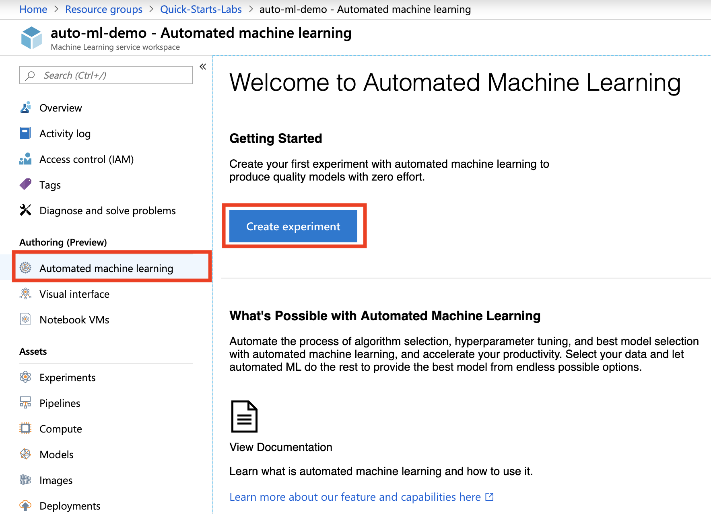

# Prerequisites

- Create an Azure Machine Learning service workspace named: `auto-ml-demo`. See [Create an Azure Machine Learning Service Workspace](https://docs.microsoft.com/en-us/azure/machine-learning/service/setup-create-workspace) for details on how to create the workspace.

## Step 1: Navigate to Automated Machine Learning in Azure Portal

- Navigate to the machine learning workspace: `auto-ml-demo`
- Select `Automated machine learning` in the left navigation bar
- Click on **Create Experiment**

## Step 2: Create Experiment

- Provide an experiment name: `auto-ml-exp`
- Click on **Create a new compute**

## Step 3: Create New Compute

- Provide compute name: `auto-ml-compute`
- Select your VM size
- Provide `Additional Settings`
- Click on **Create**

## Step 4: Upload Training Data

## Step 5: Review Training Data

## Step 6: Setup AutoML Experiment Basic Settings

## Step 7: Setup AutoML Experiment Advanced Settings

## Step 8: Review Experiment Run Results

## Step 9: Review Best Model Predictions

## Step 10: Review Best Model Metrics

## Step 11: Clean-up
